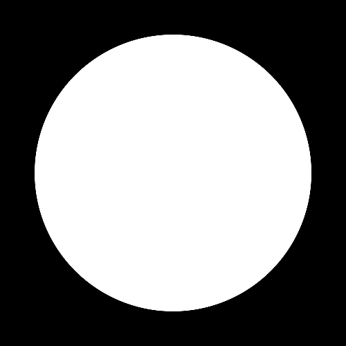
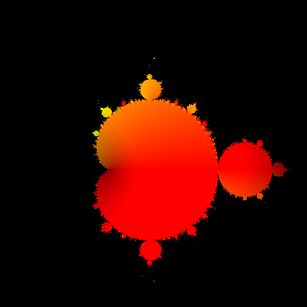

# Nim to GPU shader language compiler and supporting utilities.

Shady can compile a subset of Nim into `OpenGL Shader Language` used by the GPU. This allows you to test your shader code with `echo` statements on the CPU and then run the exact same code on the GPU.

Shady has two main goals:

* Write vertex and fragment/pixel shaders for games and 3d applications.
* Write compute shaders for offline processing and number crunching.

Shady uses:
* `pixie` library for image operations.
* `vmath` library for vector and matrix operations.
* `chroma` library for color conversions and operations.
* `bumpy` library for collisions and intersections.

# Using Shady shader toy playground:



```nim
# both CPU and GPU code:
proc circleSmooth(gl_FragColor: var Color, uv: Vec2) =
  var a = 0.0
  for x in 0 ..< 8:
    for y in 0 ..< 8:
      if (uv + vec2(x.float32 - 4.0, y.float32 - 4.0) / 8.0).length < 400.0:
        a += 1
  a = a / (8 * 8)
  gl_FragColor = color(a, a, a, 1)

# test on the CPU:
var testColor: Color
circleSmooth(testColor, vec2(100, 100))
echo testColor

# compile to a GPU shader:
var shader = toShader(circleSmooth)
echo shader
```

[See the source](examples/circle.nim)



[See the source](examples/mandelbrot.nim)

# Using Shady as a shader generator:


[See the source](examples/triangle.nim)

Nim vertex shader:
```nim
proc basicVert(
  gl_Position: var Vec4,
  MVP: Uniform[Mat4],
  vCol: Attribute[Vec3],
  vPos: Attribute[Vec3],
  fragColor: var Vec3
) =
  gl_Position = MVP * vec4(vPos.x, vPos.y, 0.0, 1.0)
  fragColor = vCol
```

GLSL output:
```glsl
#version 410
precision highp float;

uniform mat4 MVP;
attribute vec3 vCol;
attribute vec3 vPos;
out vec3 fragColor;

void main() {
  gl_Position = MVP * vec4(vPos.x, vPos.y, 0.0, 1.0);
  fragColor = vCol;
}
```

Nim fragment shader:
```nim
proc basicFrag(gl_FragColor: var Color, fragColor: Vec3) =
  gl_FragColor = color(fragColor.x, fragColor.y, fragColor.z, 1.0)
```

GLSL output:
```glsl
#version 410
precision highp float;

in vec3 fragColor;

void main() {
  gl_FragColor = vec4(fragColor.x, fragColor.y, fragColor.z, 1.0);
}
```
