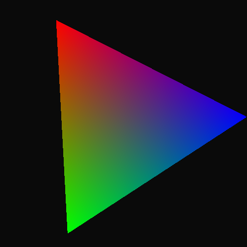

# Nim to GPU shader language compiler and supporting utilities.

Shady has two main goals:

* Write vertex and fragment/pixel shaders for games and 3d applications.
* Write compute shaders for offline processing and number crunching.

Shady uses:
* `pixie` library for images operations.
* `vmath` library for vector and matrix operations.
* `chroma` library for color conversions and operations.
* `bumpy` library for collisions and intersections.


# Using Shady as a shader generator:



Nim vertex shader:
```nim
proc basicVert(
  gl_Position: var Vec4,
  MVP: Uniform[Mat4],
  vCol: Attribute[Vec3],
  vPos: Attribute[Vec3],
  fragColor: var Vec3
) =
  gl_Position = MVP * vec4(vPos.x, vPos.y, 0.0, 1.0)
  fragColor = vCol
```

GLSL output:
```glsl
#version 410
precision highp float;

uniform mat4 MVP;
attribute vec3 vCol;
attribute vec3 vPos;
out vec3 fragColor;

void main() {
  gl_Position = MVP * vec4(vPos.x, vPos.y, 0.0, 1.0);
  fragColor = vCol;
}
```

Nim fragment shader:
```nim
proc basicFrag(gl_FragColor: var Color, fragColor: Vec3) =
  gl_FragColor = color(fragColor.x, fragColor.y, fragColor.z, 1.0)
```

GLSL output:
```glsl
#version 410
precision highp float;

in vec3 fragColor;

void main() {
  gl_FragColor = vec4(fragColor.x, fragColor.y, fragColor.z, 1.0);
}
```
